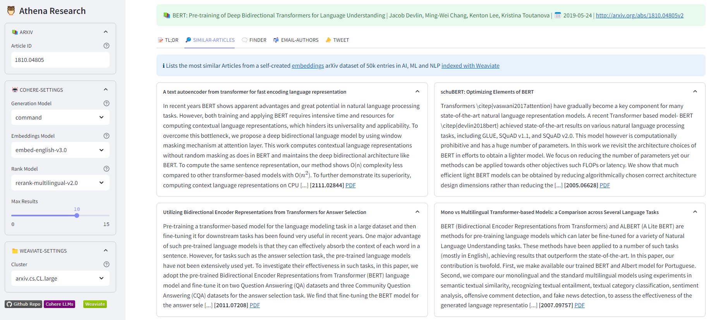

[](https://wikisearch.streamlit.app/)
[](https://www.python.org/)
[](https://github.com/dcarpintero/athena/blob/main/LICENSE)

# 🦉 Athena - Research Companion
<p align="center">
  
</p>

Athena is an AI-Assist protoype powered by [Cohere-AI](https://cohere.com/) and [Embed-v3](https://txt.cohere.com/introducing-embed-v3/) to faciliate scientific Research and Discovery. Its key differentiating features include:
- **Advanced Semantic Search**: Outperforms traditional keyword searches with state-of-the-art embeddings, offering a more nuanced and effective data retrieval experience that understands the complex nature of scientific queries.
- **Human-AI Collaboration**: Enables easier review of research literature, highlighting key topics, and augmenting human understanding.
- **Comprehensive Admin Support**: Provides assistance with tasks such as categorization of research articles, e-mail drafting, and tweets generation.

## 📚 Overview

<p align="center">
  
</p>

### Data Pipeline

As part of this project we have created two datasets of 50.000 arXiv articles related to AI and NLP using [Cohere Embedv3](https://txt.cohere.com/introducing-embed-v3/):
- [https://huggingface.co/datasets/dcarpintero/arXiv.cs.AI.CL.CV.LG.MA.NE.embedv3](https://huggingface.co/datasets/dcarpintero/arXiv.cs.AI.CL.CV.LG.MA.NE.embedv3)
- [https://huggingface.co/datasets/dcarpintero/arXiv.cs.CL.embedv3](https://huggingface.co/datasets/dcarpintero/arXiv.cs.CL.embedv3)

Steps:
1) Retrieve Articles' Metadata from ArXiv. See [./data_pipeline/retrieve_arxiv.py](./data_pipeline/retrieve_arxiv.py)
2) Embed Articles' Title and Abstract using Embedv3. See [./data_pipeline/embed_arxiv.py](./data_pipeline/embed_arxiv.py)
3) Store Articles' Metadata and Embeddings in Weaviate. See [./data_pipeline/index_arxiv.py](./data_pipeline/index_arxiv.py)

### Prompt Templates, Output Formatting, and Validation

Some of our tasks such as enriching abstracts with Wikipedia Links, crafting a glossary, composing e-mails and tweeting rely on a set of:
- [Prompt Templates](./prompts/athena.toml)

Those prompts are then composed into a LangChain chain as in the following code snippets:
- [Enrich Abstract](https://github.com/dcarpintero/athena/blob/5457229eba2c634b1bb3804aa342344b50ac278b/coral.py#L130-L150)
- [Keywords](https://github.com/dcarpintero/athena/blob/5457229eba2c634b1bb3804aa342344b50ac278b/coral.py#L153-L173)
- [E-mail Drafting w/ JSON Formatting](https://github.com/dcarpintero/athena/blob/5457229eba2c634b1bb3804aa342344b50ac278b/coral.py#L100-L127)
- [Tweet Generation w/ JSON Formatting](https://github.com/dcarpintero/athena/blob/5457229eba2c634b1bb3804aa342344b50ac278b/coral.py#L74-L97) and [Pydantic Validation](https://github.com/dcarpintero/athena/blob/5457229eba2c634b1bb3804aa342344b50ac278b/coral.py#L17-L28)


### Weaviate Schema

See [ArxivArticle](https://github.com/dcarpintero/athena/blob/5457229eba2c634b1bb3804aa342344b50ac278b/data_pipeline/index_arxiv.py#L12-L116) Class.

### Cohere Engine

The [coral.py](./coral.py) class provides an abstraction layer over Cohere endpoints.

### Streamlit App

See [app.py](./app.py)

## 🚀 Quickstart

1. Clone the repository:
```
git@github.com:dcarpintero/athena.git
```

2. Create and Activate a Virtual Environment:

```
Windows:

py -m venv .venv
.venv\scripts\activate

macOS/Linux

python3 -m venv .venv
source .venv/bin/activate
```

3. Install dependencies:

```
pip install -r requirements.txt
```

4. Run Data Pipeline (optional)

```
python retrieve_arxiv.py
python embed_arxiv.py
python index_arxiv.py
```

5. Launch Web Application

```
streamlit run ./app.py
```

## 🔗 References

- [Arxiv](https://arxiv.org/)
- [Embed-v3](https://txt.cohere.com/introducing-embed-v3/)
- [Langchain](https://langchain.com)
- [Weaviate Vector Search](https://weaviate.io/developers/weaviate/search/similarity/)